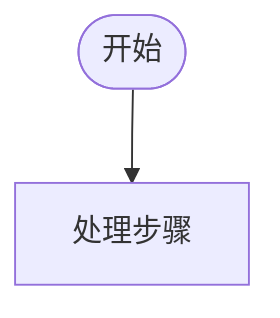

# Prototype To Flowchart Mermaid

使用本 skill 将 Figma 原型、截图、PRD 描述或用户补充的业务规则转化为基础 Mermaid `flowchart TD` 流程图。

默认目标是输出兼容性高、研发可读、适合放入 PRD 的普通流程图。不要输出泳道图、状态机图或时序图，除非用户明确改口要求。

## 1. 适用输入

支持三类输入：

- Figma 原型图链接。
- PRD / 需求文字描述。
- Figma 原型图 + 用户补充规则。

如果用户给出 Figma 链接，必须先读取 Figma 原型，再开始梳理流程。读取时重点提取：

- 页面名称、画板名称、组件/状态名称。
- 原型中的标注文字。
- 原型中的箭头、连线、跳转关系。
- 页面状态、提示、弹窗、成功/失败/异常状态。
- 用户操作和系统自动处理。
- 原型中的正式文案，例如英文状态词、按钮文案、toast 文案。

如果只给 PRD 文字描述，则直接从文字中提取流程。

## 2. 强制澄清规则

只要存在会影响流程结构的不确定信息，必须先向用户提问，不要直接画图。

常见必须确认的问题：

- 起点和终点不明确。
- 某个动作是用户触发还是系统自动触发。
- 某个状态的判定条件不明确。
- 某个异常/失败/中断分支之后如何处理不明确。
- 状态是否会影响前台可见展示不明确。
- 原型和用户文字描述存在冲突。
- 用户要求覆盖“所有异常/分支”，但原型没有说明其中某个分支。
- 多个流程是否应拆成多张图不明确。

如果存在这些问题，只输出问题清单并等待用户回答。不要输出 Mermaid 代码。

## 3. 默认输出

在信息已确认时，默认只输出 Mermaid 代码块：



不要默认输出节点清单、连线清单、业务规则说明或布局自检，除非用户明确要求。

如果用户要求“关键业务规则说明”“待确认问题”“节点清单”等，则按用户要求补充。

## 4. 流程图生成规则

默认语法：

```mermaid
flowchart TD
```

绘制原则：

- 使用从上到下的阅读方向。
- 起点必须使用用户确认的开始节点。
- 终点必须使用用户确认的结束节点。
- 使用简短节点文案，不把长说明塞进节点。
- 判断节点使用 `{是否...？}` 或 `{当前状态}`。
- 分支连线必须有明确标签，例如 `是`、`否`、`通过`、`不通过`、`已点亮`、`已熄灭`。
- 产品界面正式文案应保留原文，例如 `Pending`、`Extinguished`、`Spark Lit`。
- 系统关键状态变化要单独成节点，例如 `火花变为 Extinguished 已熄灭`。
- 如果节点文案较长，优先拆成两个短节点。

## 5. 复杂流程拆分规则

如果流程超过约 15-20 个节点，或包含多个互相独立的机制，应先建议拆成多张图。

常见拆分方式：

- 主流程。
- 提示展示/关闭流程。
- 异常/恢复流程。
- 成就/奖励/领取流程。
- 后台配置流程。
- 用户侧展示流程。

如果用户已经要求“输出多张图”，则直接按拆分结果输出多段 Mermaid 代码。

如果用户没有确认是否拆分，先给出拆分建议并等待确认。

## 6. 视觉布局规则

生成 Mermaid 前先考虑布局，避免后续导入 Figma 或 PRD 时难以阅读。

必须尽量做到：

- 主流程纵向推进。
- 避免一条线跨越很远连接到顶部或底部节点。
- 避免多个远处分支都直接汇聚到同一个终点；必要时使用局部汇聚节点。
- 避免一个判断节点承载过多出入线。
- 同类分支尽量放在相邻位置。
- 连线标签保持简短。
- 不为追求“覆盖所有细节”牺牲可读性；复杂细节优先拆图。

## 7. Figma 兼容建议

默认使用最兼容的 Mermaid `flowchart TD`，不要使用 `swimlane-beta`、复杂 HTML 标签、图标语法或较新的 Mermaid 实验语法。

如果用户计划导入 Figma：

- 节点文本尽量短，减少文本溢出。
- 避免超长连线标签。
- 复杂说明放在 PRD 文字中，而不是流程节点中。
- 多图比单张超长图更适合 Figma 编辑和截图。

## 8. 禁止事项

- 不要在没有读取 Figma 的情况下基于 Figma 链接直接画图。
- 不要在存在关键疑问时自由假设业务规则。
- 不要默认输出泳道图。
- 不要默认输出非 Mermaid 代码内容。
- 不要把未经确认的推断写成确定规则。
